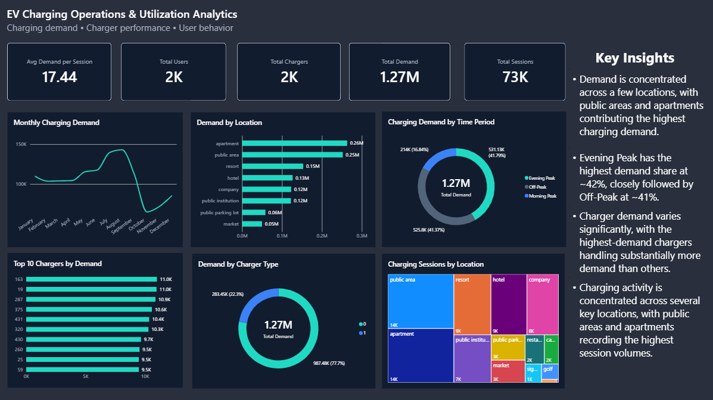

# EV Charging Operations & Utilization Analytics

An end-to-end analytics project using real-world EV charging transaction data to analyze charging demand, charger performance, location-level activity, time-based demand patterns, and user behavior using MySQL and Power BI.

## Business Problem

As EV adoption increases, charging operators need to understand how their charging infrastructure is being used.

This project addresses key operational questions:

- Where is charging demand concentrated?
- When does charging demand peak?
- Which chargers handle the highest demand?
- Which locations have the highest charging activity?
- How does demand vary across charger types?
- How does charging activity change over time?
- How concentrated is demand across users?

The analysis aims to support better charging infrastructure planning, capacity management, charger prioritization, and operational decision-making.

## Dataset

### Source

The dataset used in this project is:

**A dataset for multi-faceted analysis of electric vehicle charging transactions**

Authors: Keon Baek, Eunjung Lee, and Jinho Kim

Published in Scientific Data, 2024.

The dataset contains real-world commercial EV charging transactions collected in South Korea over the period from September 30, 2021 to September 30, 2022.

Dataset statistics:

- 72,856 charging sessions
- 2,337 users
- 2,119 chargers
- 13 variables

Source:
https://doi.org/10.1038/s41597-024-02942-9

Dataset:
https://figshare.com/articles/dataset/A_dataset_for_multi-faceted_analysis_of_electric_vehicle_charging_transactions/22495141

License: CC BY 4.0

### Dataset Description

Each row represents an individual EV charging session.

| Column | Description |
|---|---|
| UserID | Identifier for the EV user |
| ChargerID | Identifier for the charger |
| ChargerCompany | Charger company identifier |
| Location | Charging location category |
| ChargerType | Charger type identifier |
| StartDay | Charging session start date |
| StartTime | Charging session start time |
| EndDay | Charging session end date |
| EndTime | Charging session end time |
| StartDatetime | Combined charging start date and time |
| EndDatetime | Combined charging end date and time |
| Duration | Charging session duration |
| Demand | Energy demand during the session |

UserID = 0 represents customers who were not subscribed to the commercially operated company in the original dataset.

## Analytical Approach

The project was divided into SQL-based analysis and Power BI visualization.

### SQL Analysis

MySQL was used to perform operational, temporal, and behavioral analysis.

The analysis included:

1. High-demand charger analysis
2. Demand share by location
3. Top users by demand contribution
4. Peak vs. off-peak charging demand
5. Monthly charging demand trends
6. Charger performance ranking by location
7. User activity trends using LAG()
8. Demand concentration by user decile

SQL techniques used include:

- Aggregations
- GROUP BY
- HAVING
- Subqueries
- Common Table Expressions
- Window functions
- RANK()
- LAG()
- NTILE()
- Date and time functions
- Percentage calculations

## Power BI Dashboard

The analysis was translated into an interactive Power BI dashboard containing:

### KPI Metrics

- Total Sessions
- Total Users
- Total Chargers
- Total Demand
- Average Demand per Session

### Dashboard Visuals

- Monthly Charging Demand
- Demand by Location
- Charging Demand by Time Period
- Top 10 Chargers by Demand
- Demand by Charger Type
- Charging Sessions by Location

## Dashboard Preview



## Key Findings

### Demand concentration by location

Apartment and public-area locations account for some of the highest levels of charging demand, indicating that charging activity is not evenly distributed across locations.

### Peak charging demand

Evening Peak represents the largest single share of demand at approximately 41.8%, closely followed by Off-Peak demand at approximately 41.4%. Morning Peak contributes approximately 16.8%.

### Charger demand variation

Demand varies substantially across individual chargers, with a relatively small group of chargers handling significantly higher demand than others.

### Charger type demand

One charger type accounts for approximately 78% of total demand, while the other contributes approximately 22%, indicating a substantial difference in usage between charger types.

### Location-level charging activity

Public-area and apartment locations record some of the highest numbers of charging sessions, highlighting their importance for charging infrastructure planning.

### Monthly demand trends

Charging demand varies considerably throughout the year, with higher demand observed around the August–September period.

## Business Recommendations

### Prioritize high-demand locations

Infrastructure expansion should focus on locations with consistently high charging demand and session activity.

### Plan for evening demand

Operators should evaluate capacity during evening peak periods and consider demand-management strategies such as time-based pricing, off-peak incentives, and load management.

### Monitor high-demand chargers

High-demand chargers should receive greater attention for preventive maintenance, reliability monitoring, capacity assessment, and potential upgrades.

### Align charger deployment with demand

The significant difference in demand between charger types suggests that future infrastructure deployment should be guided by actual usage patterns.

### Use demand and session volume together

Locations with both high demand and high session volumes can be prioritized when evaluating future infrastructure investments.

## Tech Stack

| Technology | Purpose |
|---|---|
| MySQL | Database management and SQL analysis |
| SQL | Operational, temporal, and behavioral analysis |
| Power BI | Dashboard development and visualization |
| DAX | Measures and calculated columns |
| GitHub | Project documentation and portfolio presentation |

## Project Workflow

```text
Raw EV Charging Dataset
        |
        v
      MySQL
        |
        v
   SQL Analysis
        |
        v
    DAX Measures
        |
        v
    Power BI
        |
        v
 Interactive Dashboard
        |
        v
Business Insights & Recommendations
